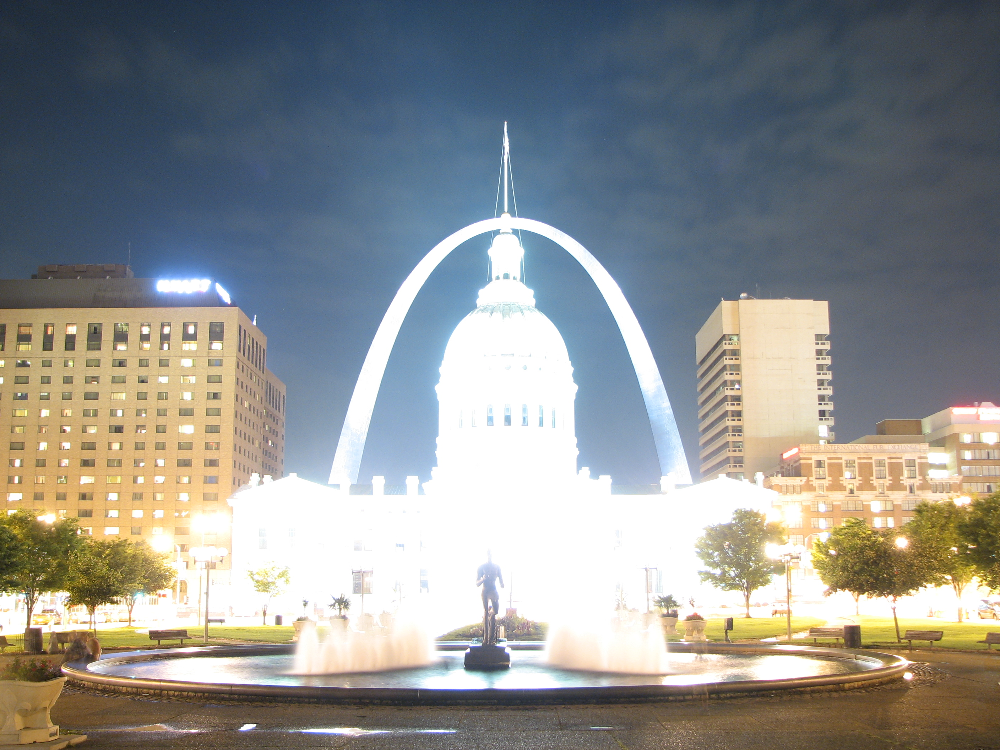
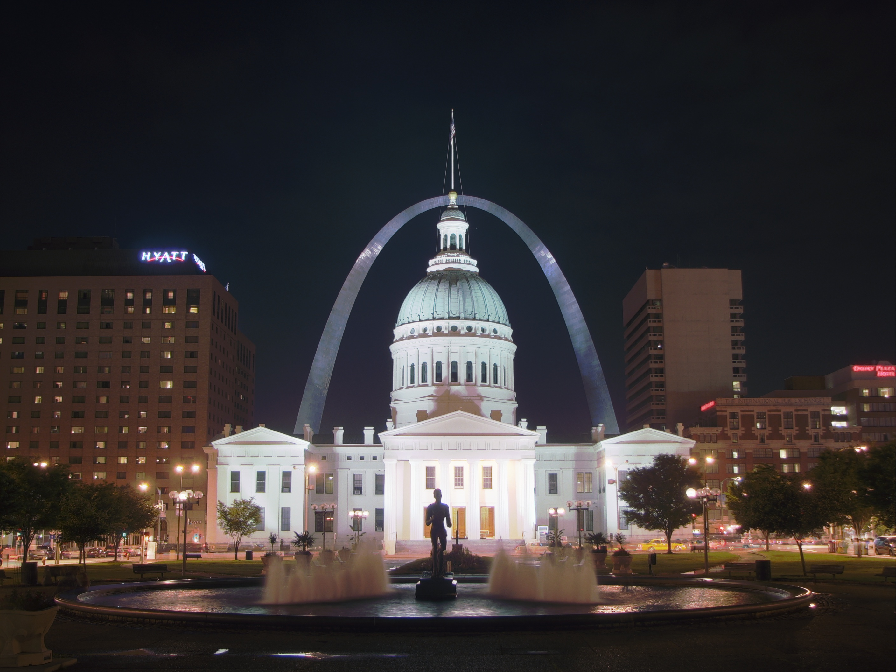

# HDRify
Convert any Image into HDR ( greater contrast ranges ) using openCV. Used 4 different methods for combining and tone mapping combined images of different contrast.

&nbsp;&nbsp;&nbsp;&nbsp;&nbsp;&nbsp;&nbsp;

